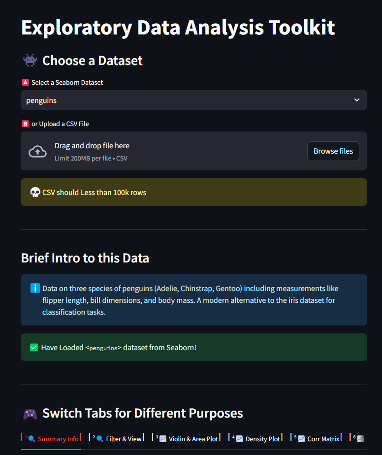
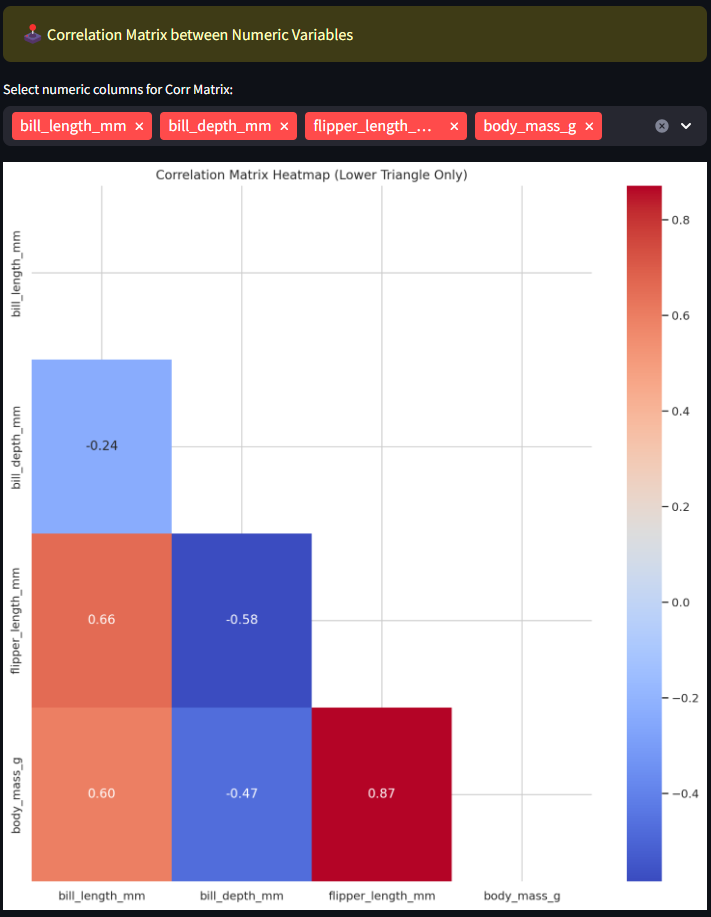
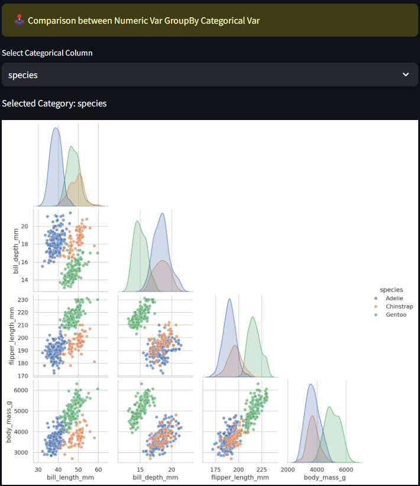

# Exploratory Data Analysis Toolkit

Welcome to the **🎮 Exploratory Data Analysis Toolkit **, an interactive Streamlit application for visualizing and analyzing datasets with ease.

## Features

- **Dataset Options**:
  - Select a dataset from Seaborn's library (`iris`, `mpg`, `penguins`, `titanic`, etc.).
  - Upload your own CSV file (with size less than 100k rows).

- **Analysis Tabs**:
  1. **Summary Info**:
     - View dataset structure, variable types, and summary statistics for numeric columns.
  2. **Filter & View**:
     - Filter rows based on selected column values and explore group statistics.
  3. **Violin & Area Plot**:
     - Visualize data distribution using violin plots and area plots grouped by categorical variables.
  4. **Density Plot**:
     - Explore correlations between numeric variables grouped by categories using KDE plots.
  5. **Correlation Matrix**:
     - Heatmap visualization of numeric variable correlations.
  6. **Pair Plot**:
     - Pairwise comparisons of numeric variables with grouping by categorical variables.
  7. **Interactive Dashboard**:
     - Advanced dashboard capabilities with [PyGWalker](https://github.com/Kanaries/pygwalker) integration.

- **Customizable Themes**:
  - Uses Seaborn's `whitegrid` style for clean and professional visuals.

## How to Use

1. **Run the Application**:
   ```bash
   streamlit run main.py
   ```
2. **Choose or Upload a Dataset**:
   - Select a preloaded dataset from the dropdown menu.
   - Upload a custom CSV file for analysis.
3. **Navigate Through Tabs**:
   - Use the tabs to explore different functionalities:
     - Summary and filtering tools.
     - Advanced plots and visualizations.
     - Interactive dashboards.

## Requirements

- **Python**: 3.8 or later
- **Libraries**:
  - Streamlit
  - Seaborn
  - Pandas
  - NumPy
  - Matplotlib
  - PyGWalker

Install dependencies with:
```bash
pip install -r requirements.txt
```

## Screenshots

### Home Page


### Violin Plot


### Area Plot


### Correlation Matrix


### Pair Plot


### Interactive Dashboard (Pygwalker)


## File Structure

```
├── main.py            # Streamlit app source code
├── requirements.txt   # Python dependencies
├── assets/            # Screenshots and visuals for documentation
└── README.md          # This README file
```

## Contributing

Feel free to open issues or submit pull requests for improvements. Contributions are welcome!

## License

This project is licensed under the MIT License. See the [LICENSE](LICENSE) file for details.

---

### Author
Developed with ❤️ by [Lean Lin]. 

For any queries or suggestions, please contact:
- [Email](mailto:xphoenixx32@gmail.com)
- [LinkedIn](https://www.linkedin.com/in/leanlin/)
